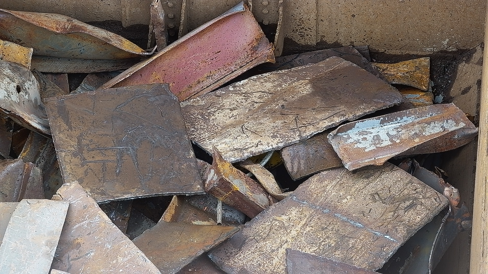
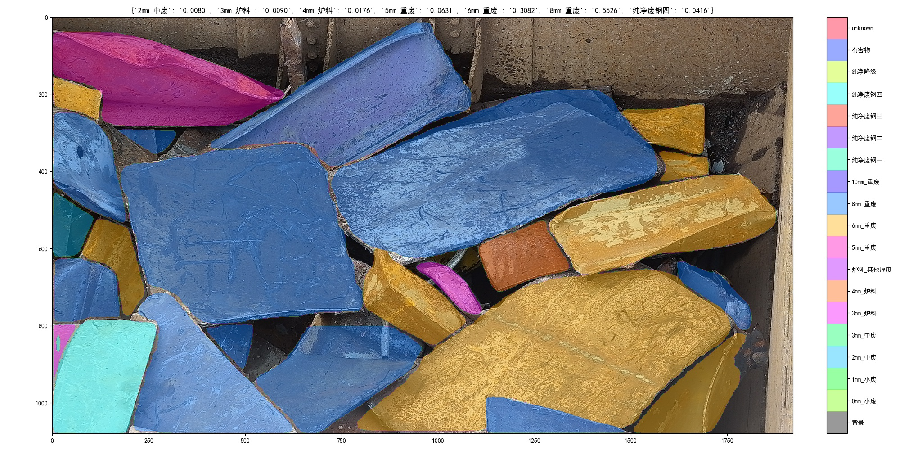

# Ningkun Zhou
## Education
* Bachelor of Science in **Genetics**, minor in **Computer Science** at the University of Wisconsin, Madison, 2015 to 2019
* Worked as a programmer for bioinformatics project in research lab
## Work at Danieli
### Camera System

  

* Auto-adaptive image acquisition, enabling stable and detailed views based on auto PTZ vs XY-Mag calibration
* Fewer duplicates acquired using YOLO Object Detection and image registration
* Decoupling the system from a huge redis-interacted single process to multiple API and RabbitMQ microservices
### Scrap Semantic Segmentation

  
  

* Fine-tuned Mask-RCNN
* Regression that links between area proportion and weight proportion
* Discovered minimum required polygon annotation by correlating mAP with num polygon
### Bale Breaker

  

* Fully automatic when a metal scrap bale is under processing
* Mechanical arm that ensures image acquisition from all angles 
### Innovation

  

* CLIP-Zero shot classification, reaching high accuracy with minimum dataset

  

* Image Search, looking up similar image from annotated data

  

* Annotation System, making every label searchable by name or feature
### Thoughts
* More comprehensive annotation management
  1. Indexing every label in database, not in files; 
  2. Multi-level labelling system
  3. Fixed Labeling list 
* More transparent proportion calculation system 
  1. The conversion from area proportion to weight proportion could be adjustable by customer
  2. Real time showcasing of annotated data besides new collected raw images
* More intelligent system
  1. Multi-Model AI to capture feature beyond visions
  2. NLP assisted computer-vision model in production environment is a must-do step for future industrial automation
## Research at Chinese Academy of Sciences
### Deep Learning Integration in Cryo-EM
* Automation in preprocessing followed by data collection
* Semantic segmentation to improve atomic reconstruction
### Publications
- Shuqi Dong, Huadong Li, **Ningkun Zhou**, et al. "Structural basis of nucleosome deacetylation and DNA linker tightening by Rpd3S histone deacetylase complex" *Cell Research*, 2023. [DOI: 10.1038/s41422-023-00869-1](https://doi.org/10.1038/s41422-023-00869-1)

- Le Tang, Shuqi Dong, **Ningkun Zhou**, et al. "Vibrio parahaemolyticus prey targeting requires autoproteolysis-triggered dimerization of the type VI secretion system effector RhsP" *Cell Reports*, 2022. [DOI: 10.1016/j.celrep.2022.111732](https://doi.org/10.1016/j.celrep.2022.111732)

## Technical Skills

- **Deep Learning**: EfficientNet, U-Net, YOLO, Mask R-CNN, ViT, CLIP
- **Programming Languages**: Python, Bash, Node.js
- **Packages**: TensorFlow, PyTorch, OpenCV, Scipy, NumPy, pandas, Matplotlib
- **Tools**: Docker, Linux, Flask, RESTful API, RabbitMQ, Redis, SQL, Git