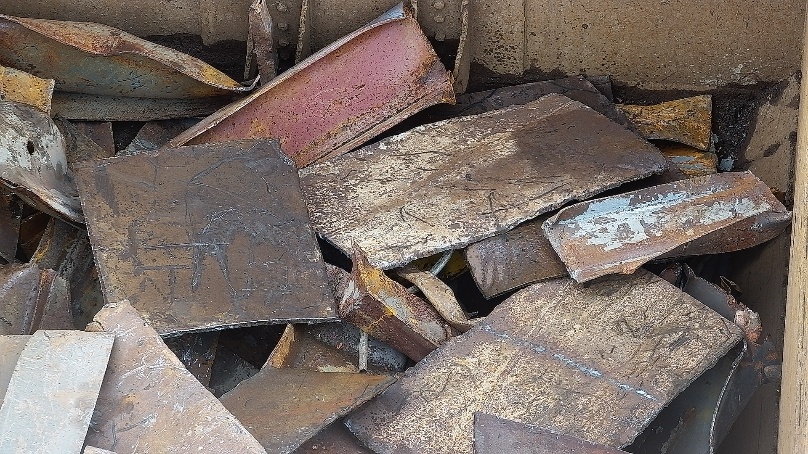
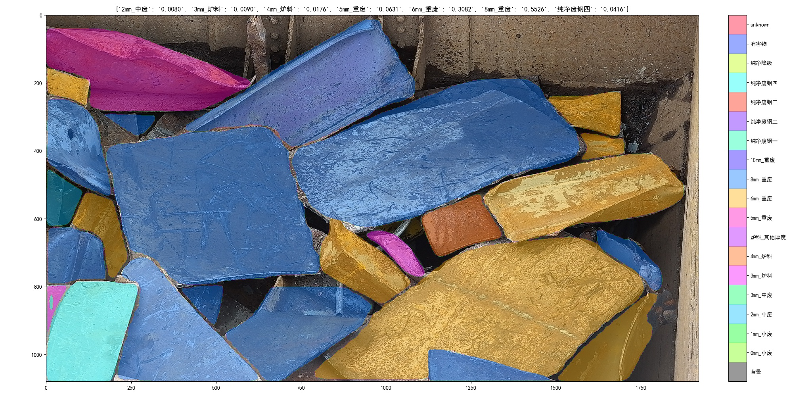

# What's Up 👋

I'm **Ningkun Zhou**, a Machine Learning Engineer with **5 year experience**, specializing in computer vision and its applications in industrial and scientific settings. I'm looking for jobs in the United Kingdom right now. 

## Professional Experience
### Danieli China
I currently work at **Danieli China**, where I **lead** the algorithm team and together we develop the **Automatic Scrap Classification System**. My expertise lies in integrating computer vision algorithms into production environments. Here are a few highlights of my work:
#### Scrap Yard Automatic Imaging

  

This image acquisition system I developed is fully automatic. Whenever a new layer of scrap exposed by the electromagnet, a detailed image will be acquired. 

- **YOLO for Object Detection**: Implemented YOLO to detect electron magnets in scrap yards for fully automatic PTZ camera image acquisition.
- **Auto PTZ Camera Zoom Calculation**: Developed an calibration algorithm to automatically adjust PTZ camera zoom factor using cross-correlation techniques.
#### Semantic Segmentation

  
  

- **Fine-tuned Mask R-CNN**: Fine-tuned Mask R-CNN for semantic segmentation for scrap metal.
- **Continuous Optimization**: Worked closely with customers, ensured 90% to 95% accuracies by vehicle. More than five projects have been accepted under my leadership. 
#### Other highlights
- **Zero-shot Image Classification**: Applied zero-shot image classification to reduce data annotation by 50%.
- **Image Search by Feature**: Developed a image search system based on contrastive loss to overcome annotation inaccuracy. 
- **Algorithm Deployment**: To deploy our algorithms, I utilized and mastered multiple communication frameworks, including RESTful API, SQL, Redis, and RabbitMQ.
## Research Experience

Prior to my industry work, I spent three years in research in the field of **Biomedical Imaging**, at Dr. Jun He's lab in [GIBH Chinese Academy of Sciences](http://english.gibh.cas.cn/), where I honed my computer vision skills and applied them to solve protein structure using Cryogenic Electron Microscopy. Here are my publications during my research years:

- Shuqi Dong, Huadong Li, **Ningkun Zhou**, et al. "Structural basis of nucleosome deacetylation and DNA linker tightening by Rpd3S histone deacetylase complex" *Cell Research*, 2023. [DOI: 10.1038/s41422-023-00869-1](https://doi.org/10.1038/s41422-023-00869-1)

- Le Tang, Shuqi Dong, **Ningkun Zhou**, et al. "Vibrio parahaemolyticus prey targeting requires autoproteolysis-triggered dimerization of the type VI secretion system effector RhsP" *Cell Reports*, 2022. [DOI: 10.1016/j.celrep.2022.111732](https://doi.org/10.1016/j.celrep.2022.111732)

Other than sample preparation and data collection, I contributed to these publication by applying several computer vision algorithms:

- **Unsupervised Classification**: K-means clustering of protein particles applied in fourier space to filter out projections from different orientation.

  

Image adapted from supplementary figures of my publication 

- **Density Map Reconstruction**: Central Slice Theorem applied to reconstruct a high-resolution 3D density map from 2D projection images. K-means clustering and Bayesian Polishing in 3D space was performed to further optimization.

  

Image adapted from supplementary figures of my publication 

- **Auto Sample Screening**: Fine-tuned EffiecientNet integrated into data collection pipeline to determine the quality of data.

  

- **Particle Segmentation**: U-Net for protein particle segmentation to determine ROI, and further improve signal to noise ratio

  

## Education

I graduated from the **University of Wisconsin–Madison**, with a major in **Genetics**🧬 and a minor in **Computer Science**💻.

## Technical Skills

- **Deep Learning**: EfficientNet, U-Net, YOLO, Mask R-CNN, ViT, CLIP
- **Programming Languages**: Python, Bash, Node.js
- **Packages**: TensorFlow, PyTorch, OpenCV, Scipy, NumPy, pandas, Matplotlib
- **Tools**: Docker, Linux, Flask, RESTful API, RabbitMQ, Redis, SQL, Git

Feel free to explore my repositories. I'm open to work right now!

---

[LinkedIn](https://www.linkedin.com/in/ningkun-zhou-087983177/) | [nkzhou26@gmail.com](nkzhou26@gmail.com) | [resume_in_PDF](docs/resume_Ningkun_Zhou.pdf)
